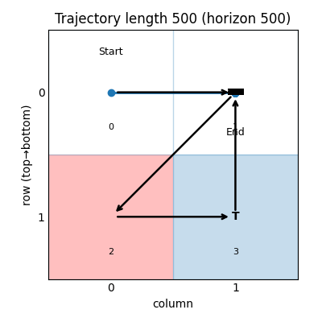

- [[FAC研究]]
	- 大 FAC大失敗啊... 當我把 solve Q value linear system換成 partially solve only for actions that advantage $\geq$ 0，整個結果直接壞掉，甚至連底下這個 2x2的迷宮都解決不了
	- 
	- 這邊紅色的是障礙物 (r=-50)，藍色的是 goal (r=1)。可以看到 state = 1 (右上)出了個包，policy並沒有選擇往下，而是停留在原地(action = up to bump into the wall)。這是由於在第一次更新後，$(1, down)$這個 state-action pair被認定有 $< 0$的 advantage，因此就不再更新 Q-value了。為什麼 $advantage(1, down) < 0$呢? 因為 state = 3在當時有可能會向左走撞到障礙物，導致他的 q-value非常低。
	- 經過這次的研究，我總算理解為什麼 off-policy演算法這麼無力了。你看喔，我要讓 $(1, down)$這個 state-action pair出現在我的 trajectory裡，要嘛就用 $Value(3)$來引導 Q$(1, down)$提升，要嘛就用 model-based的方法告訴我 $(1, down)$會把我引導到一個其實很棒的狀態 $3$。但，不管是哪種方式，少不了的都是「需要 $(1, down)$會把我引導到狀態 $3$的經驗」。
	- 問題是，這經驗去哪裡找?